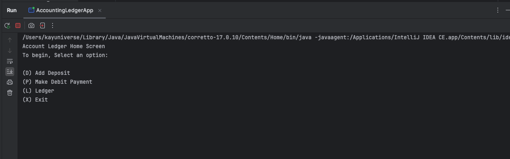
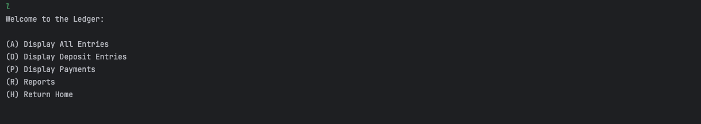
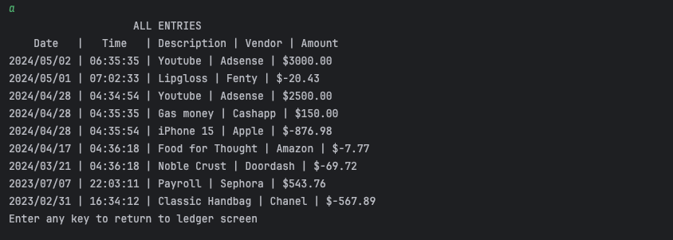
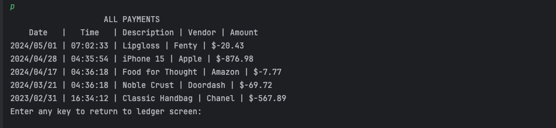
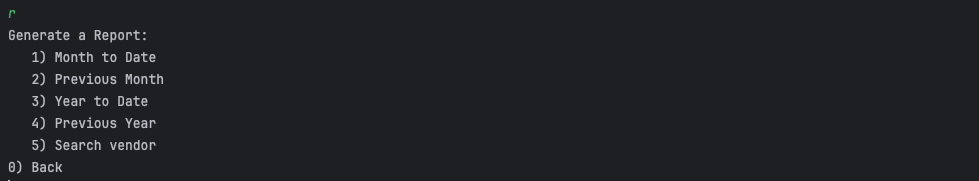
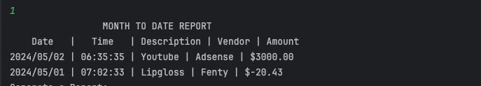
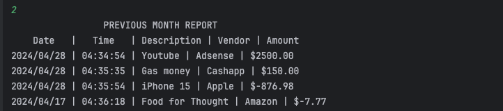
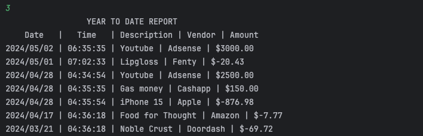
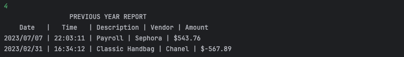
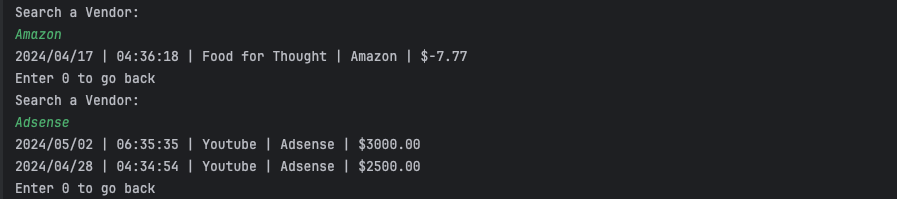

# Accounting Ledger App
This app is designed to keep track of a user's transactions and records the information. 
After the user enters a transaction, it will be stored in a ledger. Through the `Ledger` screen, 
user has access to screens that reveal data on all Transactions, only payments, and only deposits.
In the `Reports` screen, Users can view monthly or annual reports or search for transactions from a specific vendor.

## **Table of Contents**
- [Home Screen] (#Home)
- [Ledger Screen] (#Ledger)
- [Reports Screen] (#Reports)
- [Summary] (#Project-Summary)

### Home

*From the home screen, the user can select an option to view the ledger, add a deposit, or payment.*

## Ledger

*The ledger screen allows for the user to view all transactions, only payments, only deposits, or check reports for the ledger.*

*The display for all entries reveals all the transactions that have been successfully completed.*

*This screen reveals only the deposits made in the account.*

*This screen reveals only the payments made in the account.*

## Reports

*This screen allows for the user to generate a report or search for transactions from a specific vendor*

*Reveals the entries up to date with the current month*

*Reveals all entries from the previous month*

*Reveals all entries for the current year*

*Reveals all entries from the year before*

*Allows user to search for all entries of a specific vendor*

## Project Summary

### Interesting Piece of Code

`if (input.equalsIgnoreCase("R")) {
break;
// Interesting piece of code
// Because the if and else statements are also identical
} else {
break; }`
*I used this statement for some screens to allow the user to go back with any key instead of 0 or R*
